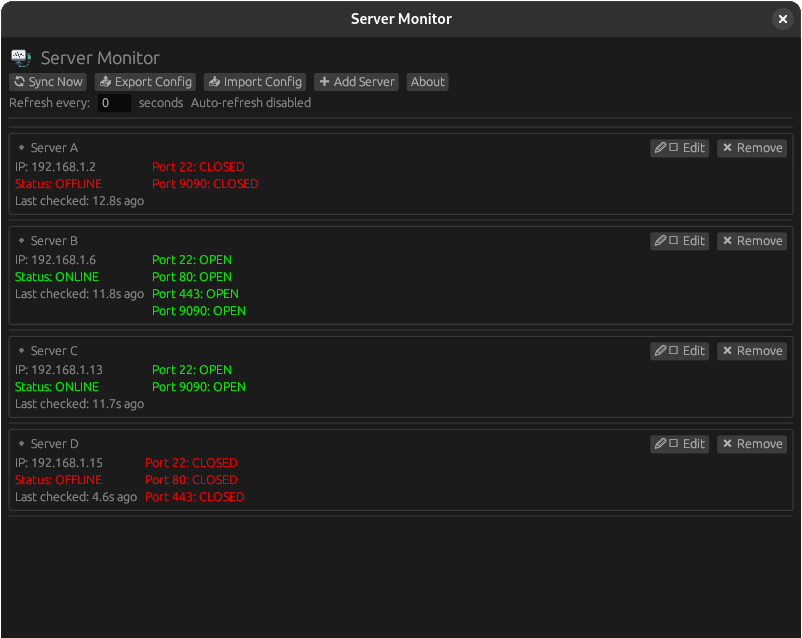

# rserver_monitor

**rserver_monitor** is a cross-platform GUI app built with [`eframe`](https://github.com/emilk/egui/tree/master/crates/eframe) + `egui` that monitors servers in real time via ping and port scanning. This was intended for Linux only, other systems may have issues.

Easily view which servers are online, which ports are open. Configurable, user-friendly, and async using `tokio`.

Setting the refresh rate to 0 will disable auto-refresh.



---

## Current Features

-  Real-time server monitoring (ping + TCP port checks)
-  Auto-refresh at configurable intervals
-  GUI dialogs for adding/editing/removing servers
-  Persistent config saved to `$HOME/.servermon.cfg`
-  Built with modern Rust 2024 edition

---

## Dependencies

- [`eframe`](https://docs.rs/eframe)
- [`egui`](https://docs.rs/egui)
- [`tokio`](https://tokio.rs/)
- [`ping`](https://crates.io/crates/ping)
- [`serde`](https://serde.rs/)
- [`serde_json`](https://docs.rs/serde_json)
- [`image`](https://crates.io/crates/image)
- [`dirs`](https://crates.io/crates/dirs)

---

## Installation

### Prerequisites

- Rust 1.76+ (2024 edition support)
- `cargo` CLI

### Build and Run

```bash
git clone https://github.com/awelshi/rserver_monitor.git
cd rserver_monitor
cargo run --release
```

## Troubleshooting

If all servers are showing offline despite being up, you may need to run the application with ```sudo``` or alternatively give the applications the permissions, which won't require ```sudo``` to run it.

```sudo setcap cap_net_raw=eip rserver_monitor```
